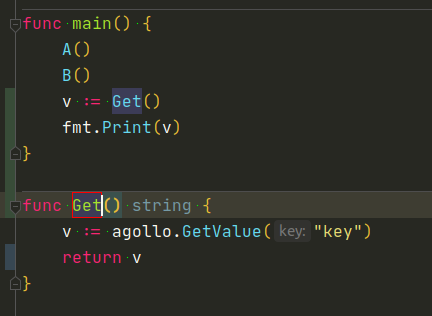
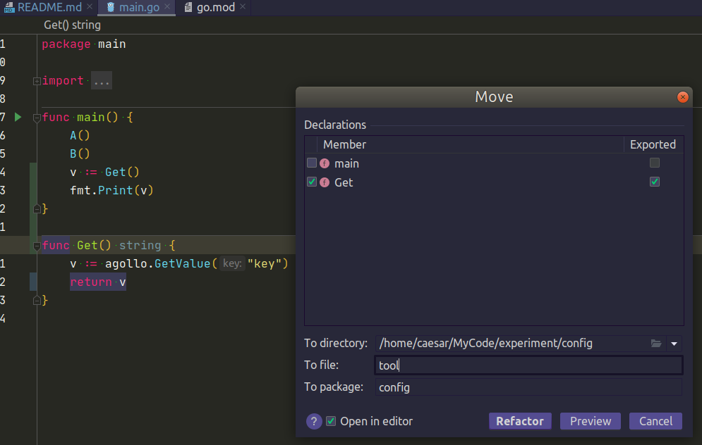
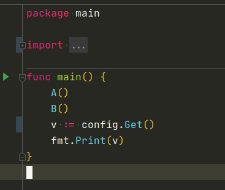
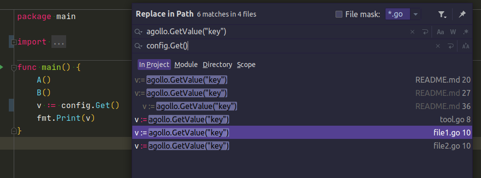

# 實驗 jetbrain goland 重構功能

## 情境
legacy code 某個第三方套件的函數  
散落在各個檔案  
現在希望呼叫後, 再多做某些事情

不想要一次手動改多個地方  
所以想說將第三方套件的函數  
提取為自己專案的 package 的函數

原本呼叫 第三方套件函數 的地方  
改為呼叫自己新定義的函數

## 目標
將專案中  
所有如下方形式的程式碼  

```
v:= agollo.GetValue("key")
```

提取變為新的 package 名稱為 config  
新函數為 Get
```
// 原先
v:= agollo.GetValue("key")

---

// 後來
v := config.Get()

func Get() string {
    // do something
    v := agollo.GetValue("key")

    return v
}
```
## 個人作法

### step 1  
先在某一個檔案, 此範例的 main.go 檔案  
將 特定第三方函數  
重構的提取為自己的函數  
extract method  


### step 2  
用 move 功能, 搬到新定義的 package

before:  


after:  


### step 3  
其他檔案用複製貼上的方法取代  
使用 replace in path  
import package 的部份靠 goland 補全


## 其他資訊
此專案無法執行, 不需要 go run  
只是用來實驗重構功能

